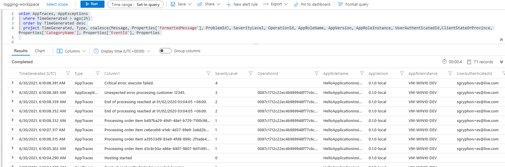

# HelloApplicationInsights

Azure Monitor / Azure Log Analytics Workspace / Application Insights example.

## Running the Example

Pre-requisites:

* PowerShell, https://github.com/PowerShell/PowerShell
* Azure CLI, https://docs.microsoft.com/en-us/cli/azure

You need to create an Azure Log Analytics Workspace and linked
Application Insights instance in your default subscription. (You can also
pass in a different subscription if you want.) 

The following scripts will create the needed resources in Azure:

```
az login
$defaultSubscription = (az account show | ConvertFrom-Json).id
./infrastructure/deploy-infrastructure.ps1 $defaultSubscription hello-ai
```

The scripts will output the Instrumentation Key needed for the apps.

By default the scripts will create resources in WestUS in a resource group
named 'hello-ai' (this can be changed in the variables). Azure CLI commands
are (mostly) idempotent, so you can re-run the scripts as needed.

Then run the HelloApplicationInsights example in a console:

```powershell
dotnet run --project ./examples/HelloApplicationInsights -- --Environment Development
```

Open the Log Analytics Workspace in Azure, and you can use a query similar
to the following:

```
union AppTraces, AppExceptions
| where TimeGenerated > ago(2h)
| order by TimeGenerated desc
| project TimeGenerated, Type, coalesce(Message, Properties['FormattedMessage'], ProblemId), SeverityLevel, OperationId, AppRoleName, AppVersion, AppRoleInstance, UserAuthenticatedId,ClientStateOrProvince, Properties['CategoryName'], Properties['EventId'], Properties
```

**Example output: Azure Log Analytics Workspace** 




## Configuration

You should use `ConnectionString` instead of just `ApiKey` in your `ApplicationInsights` configuration settings.

Setting `DeveloperMode` to `True` in your Development environment disables buffering, which means the log messages will be seen earlier.

If you log is a bit empty, you may also want to set `Logging.ApplicationInsights.LogLevel.Default` to be able to see Debug messages. (Generally Trace level messages may contain sensitive information and should not be logged.)


