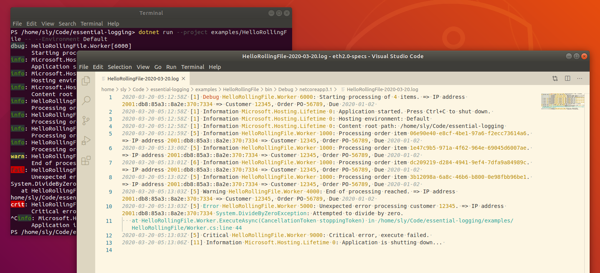

# RollingFileLoggerProvider

This logger provider writes to a rolling log file, using a custom template, with the file rotated based on the time, e.g. daily, hourly, etc.

## Basic usage

Add a reference to the `Essential.LoggerProvider.RollingFile` package:

```powershell
dotnet add package Essential.LoggerProvider.RollingFile
```

Then, add the provider to the loggingBuilder during host construction, using the provided extension method. 

```c#
using Essential.LoggerProvider;

// ...

    .ConfigureLogging((hostContext, loggingBuilder) =>
    {
        loggingBuilder.AddRollingFile();
    })
```

## Example

* [HelloRollingFile](../../examples/HelloRollingFile/ReadMe.md)



## Configuration

The logger provider will be automatically configured with any logging settings under the alias `RollingFile`. 

The following default settings are used, and can be overridden (we suggest at least overriding the "IncludeScopes" setting).

```json
{
  "Logging": {
    "RollingFile": {
      "FilePathTemplate": "{BaseDirectory}/{ApplicationName}-{DateTime:yyyy-MM-dd}.log",
      "IncludeScopes": false,
      "IsEnabled": true,
      "Template": "{DateTime:u} [{ThreadId}] {LogLevel} {CategoryName} {Id}: {Message}{ScopeList} {Exception}"
    },
  }
}
```

If you want to configure from a different section, it can be configured manually:

```c#
    .ConfigureLogging((hostContext, loggingBuilder) =>
    {
        loggingBuilder.AddRollingFile(options =>
            hostContext.Configuration.Bind("Logging:CustomRollingFile", options));
    })
```

### Template options

These template options are used in both the `FilePathTemplate` and log `Template`. If you want a rolling file you should 
include a suitable date argument.

#### Log template values

Only available in the log `Template`. Usual formatting codes can be used based on the type, e.g. "{Id:0000}" will format the numeric EventId with leading zeros.

| Token | Alternate | Type | Description |
| ----- | --------- | ---- | ----------- |
| CategoryName | Category, Source | string | The name of the category (namespace and class) of the logger. |
| EventID | | string |The name of the EventId |
| Exception | | Exception |The full exception. |
| ExceptionMessage | | string | The Message property of any exception. |
| ID | | int | The numeric value of the EventId |
| LogLevel | EventType | LogLevel | The log level: Critical, Error, Warning, Information, Debug, or Trace. |
| Message | | string | The formatted log message and arguments. |
| ScopeList | | string | List of scope values, each prefixed with " => ". |
| Scopes | | string | Concatenated scope values, with no space in between. |
| Severity | | int | The syslog severity corresponding to the log level, 2 = critical, 3 = error, 4 = warning, 6 = information, 7 = debug and trace. (Used in the Systemd format of ConsoleLoggerProvider) |
| ShortLevel | ShortLogLevel | string | A short four letter code for the log level: crit, fail, warn, info, dbug, or trce. (Used in the default ConsoleLoggerProvider) |


#### System values

Available in both `FilePathTemplate` and log `Template`, although they may not always be relevant.

As above, standard formatting codes can be used, e.g. in the default file path template "{DateTime:yyyy-MM-dd}" is used to create file names that roll on a daily basis.

| Token | Alternate | Type | Description |
| ----- | --------- | ---- | ----------- |
| %environment_variable% | | string | Value of the specified environment variable, from `Environment.GetEnvironmentVariable()`. |
| ActivityId | | Guid | From `System.Diagnostics`, value of `CorrelationManager.ActivityId`. |
| AppDomain | | string | Current AppDomain. Value of `AppDomain.CurrentDomain.FriendlyName`. |
| ApplicationName | | string | Name of the application, used in the default log file. From the entry assembly file name. |
| DateTime | UtcDateTime | DateTimeOffset | Current UTC date and time. |
| LocalDateTime | | DateTimeOffset | Current local date and time, and offset. |
| LogicalOperationStack | | string | From `System.Diagnostics`, list of values from `CorrelationManager.LogicalOperationStack`. |
| MachineName | | string | The computer name. Value of `Environment.MachineName`. |
| PrincipalName | | string | Current user principal. Value of `Thread.CurrentPrincipal.Identity.Name`. |
| Process | CommandLine | string | The original process that was executed. Value of `Environment.CommandLine`. |
| ProcessId | | int | The current process ID. From `Process.GetCurrentProcess()`. |
| ProcessName | | string | The current process name. From `Process.GetCurrentProcess()`. |
| Thread | | string | Name of the thread. Either `Thread.CurrentThread.Name`, or if that is null then the thread ID. |
| ThreadId | | int | Current thread ID. Value of `Thread.CurrentThread.ManagedThreadId`. |
| UserDomainName | |string | The current domain, either the machine name or a Windows domain. Value of `Environment.UserDomainName`. |
| UserName | | string | The current user. Value of `Environment.UserName`. |

The following directory values may also be used. These are more relevant for `FilePathTemplate`.

| Token | Alternate | Type | Description |
| ----- | --------- | ---- | ----------- |
| ApplicationData | | string | Value of `ApplicationData` from Environment.GetFolderPath(). '/home/(user)/.config' on Linux/OSX, 'C:\Users\\(user)\AppData\Roaming' on Windows. |
| BaseDirectory | | string | Directory the application is running from. Value of `AppDomain.CurrentDomain.BaseDirectory`. |
| CommonApplicationData | | string | Value of `CommonApplicationData` from Environment.GetFolderPath(). '/usr/share' on Linux/OSX, 'C:\ProgramData' on Windows |
| CurrentDirectory | | string | Current system directory. Value of `Environment.CurrentDirectory`. |
| LocalApplicationData | | string | Value of `LocalApplicationData` from Environment.GetFolderPath(). '/home/(user)/.local/share' on Linux/OSX, 'C:\Users\\(user)\AppData\Local' on Windows. |

